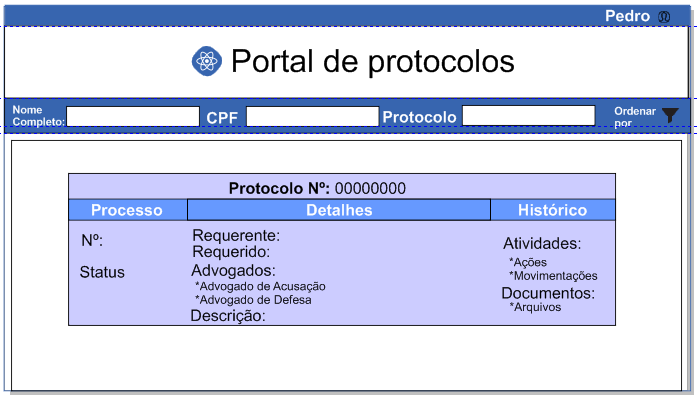

#Teste técnico - frontend - 2ª etapa

Nesta segunda etapa queremos medir a sua capacidade de entrega de valor.
Desenvolva uma solução que atenda às histórias (necessidades) descritas abaixo.
Não deixe de justificar o porquê de cada decisão tomada ao propor a solução.
Sinta-se livre para propor mudanças e sugerir novas regras de negócio.

Bom trabalho!

**Portal de Protocolos**

Objetivo: possibilitar que  um processos já finalizados fique disponível para consulta através de uma URL externa e mediante validação múltipla de dados. Desta forma, todo e qualquer cidadão conseguira visualizar um processo desde que tenha em mãos os dados de acesso.

Na interface deve constar o logo da empresa que está fornecendo este serviço e navegação básica capaz de orientar o usuário independentemente de onde veio.

Para a consulta ser efetuada o usuário deverá preencher os campos Número do Protocolo, Nome Completo e CPF com dados válidos. A busca somente apresentará um resultado se todos os campos estiverem corretos.

No resultado da busca deverão constar os itens:
Número do Protocolo pesquisado
Informações do Processo (Número, status, requerente, requerido, advogados das partes e descrição do processo)
Histórico de atividades (histórico de todas as ações e movimentações realizadas durante o processo)
Histórico de Documentos (histórico dos arquivos submetidos durante o processo)

#wireframe

