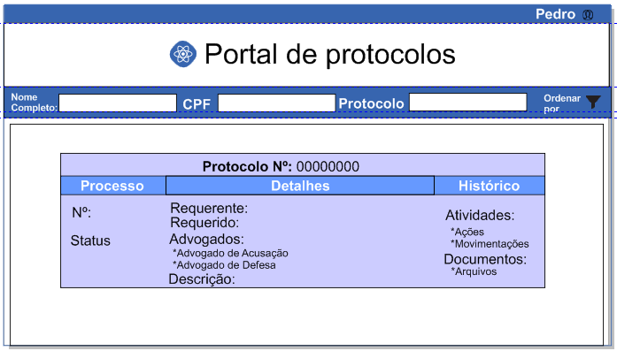
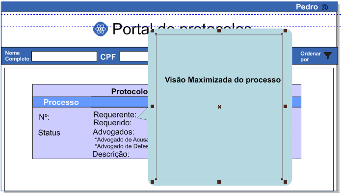

#Teste técnico - frontend - 2ª etapa

**Enunciado:**

    Nesta segunda etapa queremos medir a sua capacidade de entrega de valor.
    Desenvolva uma solução que atenda às histórias (necessidades) descritas abaixo.
    Não deixe de justificar o porquê de cada decisão tomada ao propor a solução.
    Sinta-se livre para propor mudanças e sugerir novas regras de negócio.

    Bom trabalho!

    **Portal de Protocolos**

    Objetivo: possibilitar que  um processos já finalizados fique disponível para consulta através de uma URL externa e mediante validação múltipla de dados. Desta forma, todo e qualquer cidadão conseguira visualizar um processo desde que tenha em mãos os dados de acesso.

    Na interface deve constar o logo da empresa que está fornecendo este serviço e navegação básica capaz de orientar o usuário independentemente de onde veio.

    Para a consulta ser efetuada o usuário deverá preencher os campos Número do Protocolo, Nome Completo e CPF com dados válidos. A busca somente apresentará um resultado se todos os campos estiverem corretos.

    No resultado da busca deverão constar os itens:
    Número do Protocolo pesquisado
    Informações do Processo (Número, status, requerente, requerido, advogados das partes e descrição do processo)
    Histórico de atividades (histórico de todas as ações e movimentações realizadas durante o processo)
    Histórico de Documentos (histórico dos arquivos submetidos durante o processo)

---

**wireframe**

**wireframe**

**wireframe com visão de processo maximizada**

---

**Tecnologias e Métodos utilizados:**
* html5, CSS3 e javascript;
* GIT bash;
* Methodology BEM;
* jquery;
* wireframe;
* devtools

----

**Tecnologias e justificativas**

* utilizei:

* 1º html5: Devido as propriedades de validação ;
* 2º GIT bash : Para fazer o versionamento do código;
* 3º Methodology BEM : Para facilitar a compreensão e manutençãoi do código;
* 4º wireframe: Para planejamento da tela;
* 5º devtools: Para auxiliar no desenvolvimento. 

* Obs.: Eu iria utilizar algumas soluções porém não foi possível devido a tempo disponível.

* 1º javascript: validação do próprio html5,
obs.: Não concluí porem tenho um projeto que demonstra meus conhecimentos em validações no repositório suportedesk.

* 2º jquery: para fazer seleção do DOM, a sua manipulação e animações;
obs.: Não concluí porem tenho um projeto que demonstra meus conhecimentos em jquery, no repositório printshop.

* 3º jasmine: Para testar as regras de negócio;

* 4º Regexp: Para a procura de protocolos e processo
obs.: Não concluí porem tenho um projeto que demonstra meus conhecimentos em Regexp, no repositório codeista.

* 5º Sass: Para auxiliar a manutenção do código
obs.: Não concluí porem tenho vários projetos que demonstram meus conhecimentos meste meu perfil do github.

* 6º json: para criar tabelas dinamicamente e pesquisá-las;
obs.: Não concluí porem tenho um projeto que demonstra meus conhecimentos em json, no repositório codeista.

* 7º Documentação: Para facilitar a manutenção futuramente e conhecimento do sistema. 
obs.: Comecei a fazer mas está no caderno e o tempo se esgotou.
